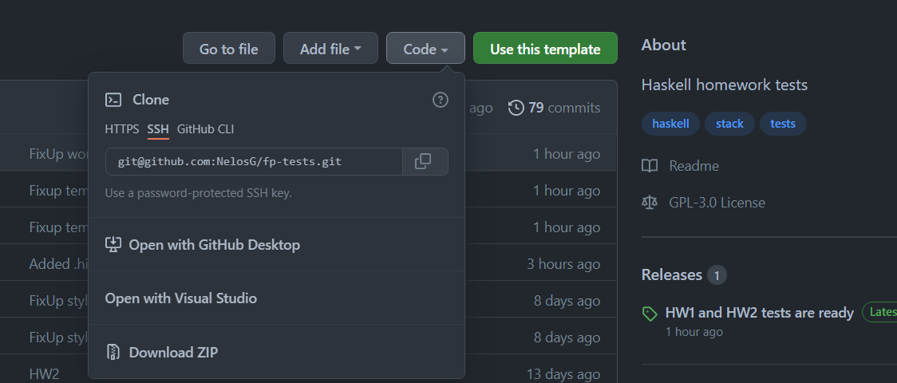
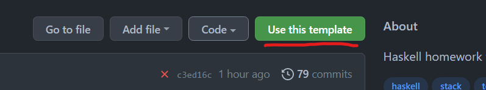
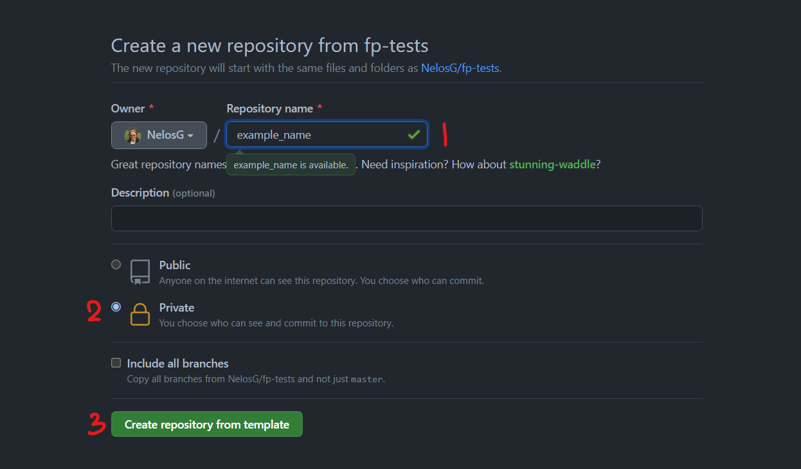

# FP homework-tests

Положите свои решения в ``src/HW+/T*.hs``. Тесты запускаются командой ``stack test hw+:t*``, где вместо ``+`` нужно написать номер домашнего задания, а вместо ``*`` нужно написать номер тестируемого модуля. Все тесты запускаются командой ``stack test hw+``.

## Использование

Вы можете склонировать репозиторий или скачать *zip*:

Или используя темплэйт (кнопка '**Use this template**') создать свой приватный репозиторий:

